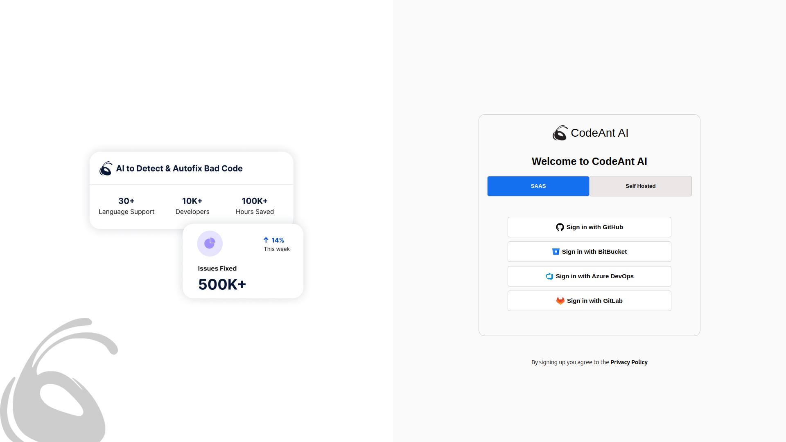
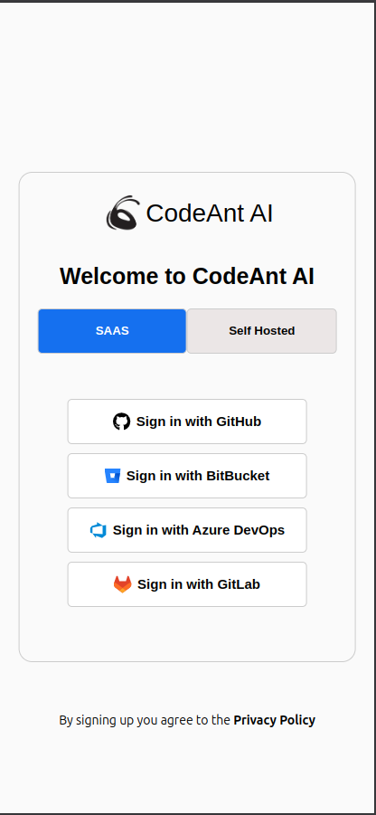
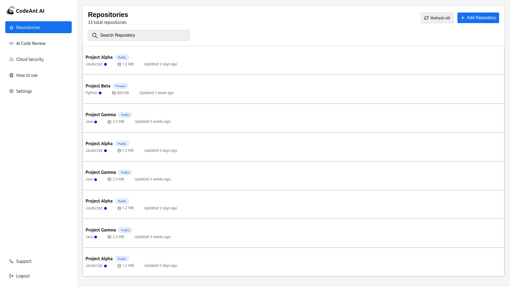

# codeAntin
The project is a web-based UI application designed to as part of Assignment of CodeAnt provide a login page and a home page which consists of list of repositories details. It is built using React js


## Installation
- Make sure npm installed in your env, After clonig this repo run these commands
 ```bash
 npm install react react-dom react-router-dom react-icons
 ```

- After installaing these libraries runt this command
```bash
    npm start
```


## Usage Instructions
- Once you start the server it will direct to Login page directly, when you click on any Oauth sign in way you will be directed to Home page.
- When you open Login page in Mobile dimension mode stats section disappears and only signin section will be visible as shown 

- Home page consists of Sidebar with defferent tabs on the left side of the screen and List of repositories at the right side of the screen.
- When you open Home page in Mobile dimension mode Sidebar disappears and will be converted to Heading bar with drop-down menu button

- "/" url for loign page
- "/main" url for Home page


## Future implementations
- Mobile view of Home page is not acurate, will modify in further versions
- Can implement dark theme


## Images

- This is the **Login Page** in desktop view


- This is the **Longin Page** in Mobile view


- This is **Home Page** in desktop view


